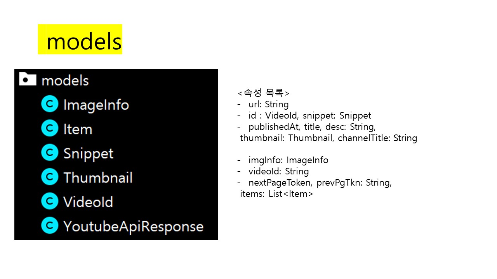

# Review-YoutubeDownloader
Github의 Marwa-Eltayeb/ YoutubeDownloader 코드를 분석해보았습니다.

# 분석 코드
 
https://github.com/Marwa-Eltayeb/YoutubeDownloader

## 분석 결과 (확신X)
Intent와 PagedList<Item>를 이용하여 사용자가 영상 검색

RetrofitClient와 PagedKeyedDataSource<String, Item>으로 NW통신

ViewModel로 PagedList와 연결
 
 
## 설명

