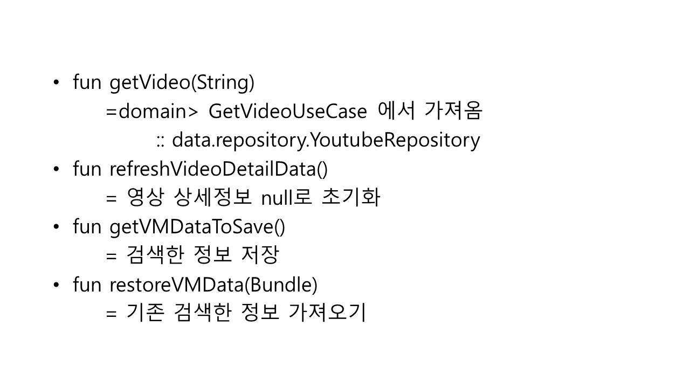

# Review-YoutubeSearchApp
Github의 nurisis/YoutubeSearchApp 코드를 분석해보았습니다.

# 분석 코드
https://github.com/nurisis/YoutubeSearchApp

## 분석 결과 (확신X)
Result<T>와 MutableLiveData & LiveData 이용하여 검색 결과 확인
  
retrofit2.Response와 gson.annotations.SerializedName 로 NW통신
  
koin.androidContext 과 modules & sharedViewModel 로 데이터 공유

## 느낀 점
 MVC 패턴을 활용하여 코드를 구성함.

사용자의 이용 데이터를 저장하거나, UI상 활용할 코드가 많음.

하지만 fragment를 이용하여 전반적인 UI확인이 어려움.

Observer 활용, xml상의 option menu 등의 이해가 어려움.

## 설명

